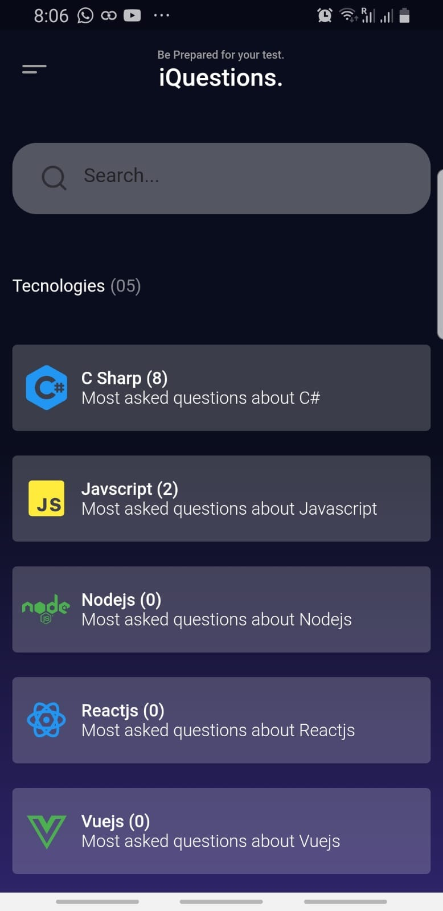

# iQuestions 📝

Welcome to Iquestions project! A simple App made with flutter where you can create Q&A List.

This is a Fully Functional App that uses GetX State Management Pacakge and Get Storage to save the Questions  😊

# Screenshots

